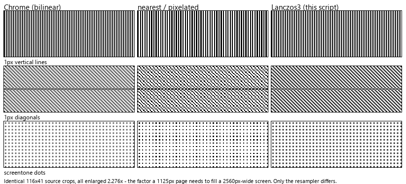
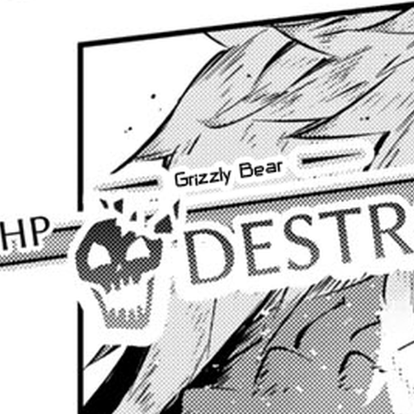
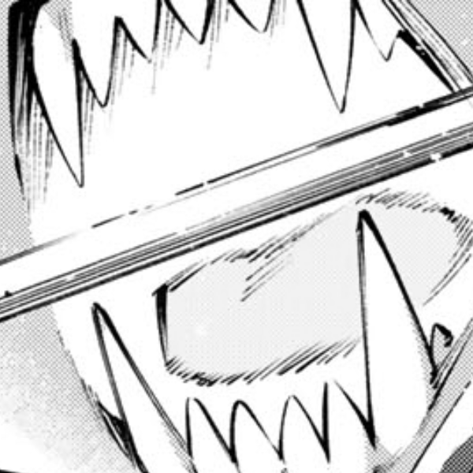

# Crisp Images

**Images look soft on your 4K or HiDPI screen? This fixes it.**

On a high-DPI display at 200% scaling, or any Retina screen, the browser draws a 1125-pixel-wide image across 2250 physical pixels. It has to invent three out of every four pixels, and it uses a cheap filter to do it. That's the mushy, washed-out, and overly soft look you may have noticed.

This script redraws those images with a proper **Lanczos3** filter on your GPU, at exactly the size they'll appear, so the browser's own scaling never touches them.



Check out the real-world comparisons below! The improved perceptual image quality is there.

Built for reading manga and comics. Works on any image, [anywhere](https://github.com/Ikkoru/crisp-images#Privacy). Contains features useful for any scaling, even the default 100% scaling!

## Install

1. Install [Tampermonkey](https://www.tampermonkey.net/) or [Violentmonkey](https://violentmonkey.github.io/).
2. Install the script.
3. Open a page with a big image and press **`Alt+P`** to switch it on for that site.
4. Press `Alt+H` to see what it's doing.

**The script starts switched off**, so it never changes a page you did not ask it to. `Alt+P` is remembered per site, so you turn a site on once and it stays on, turn it off and it stays off. To have it active everywhere instead, set `enabledOnStart: true` in the userscript.

## Controls

| Key                                 | What it does                                                                              |
| ----------------------------------- | ----------------------------------------------------------------------------------------- |
| `Alt+H`                             | Show or hide the info overlay. Remembered per site                                        |
| `Alt+M`                             | Size: fit the window width → biggest whole-number zoom → one image pixel per screen pixel |
| `Alt+Q`                             | Filter: Lanczos3 → nearest → browser. Same size each time, so you can compare             |
| `Alt+P`                             | Turn on or off for this site. Remembered per site                                         |
| `Alt` + left click<br/>on an image  | Show that one image at one image pixel per screen pixel                                   |
| `Alt` + right click<br/>on an image | Show that one image at twice its own resolution                                           |
| `Alt+G`                             | Show or hide the overlay's diagnostic rows (size, factor, status, memory)                 |

Enlarging one image never nudges the others left or right.

## A note on memory

Resampled images are kept in memory so switching filters or scrolling back stays instant. That's up to 64 MB per tab, which is fine for a handful of tabs. Keep a lot of image-heavy tabs open with the script active at once and it adds up, so you may want to tidy up now and then.

Easiest ways to keep it in check:

- Only switch on the sites you actually read — memory is spent per site you enable.
- Press **`Alt+P`** again on a site you're finished with.
- **Close tabs** you're finished with — everything is freed straight away.
- Use a tab suspender such as **The Marvelous Suspender**, or Chrome's built-in **Memory Saver**. Both work well with this script.

## Configuration

Edit the `CFG` block at the top of the script.

| Setting                                | Default     | What it does                                                                                              |
| -------------------------------------- | ----------- | --------------------------------------------------------------------------------------------------------- |
| `enabledOnStart`                       | `false`     | Whether pages are resampled without being asked. Off means nothing happens until you press `Alt+P`        |
| `hudOnStart`                           | `true`      | Whether the HUD is on by default for each site. Switching with Alt+H makes the site remember this setting |
| `detailsOnStart`                       | `false`     | Whether the overlay's diagnostic rows start visible. `Alt+G` toggles them for the current page            |
| `minNaturalWidth` / `minNaturalHeight` | 800 / 1066  | Leave smaller images alone — avatars, icons, banners                                                      |
| `mode`                                 | `fit-width` | Size to start with                                                                                        |
| `quality`                              | `lanczos3`  | Filter to start with                                                                                      |
| `fitHeightToo`                         | `false`     | Fit the height as well, so a whole page fits on screen                                                    |
| `maxOutputPixels`                      | 64M         | Don't resample beyond this many output pixels                                                             |
| `blobBudget`                           | 64MB        | Memory to spend keeping resampled images ready                                                            |
| `lazyMargin`                           | 1.5         | How many screenfuls beyond the window to prepare images so they are ready before you scroll to them       |

## Local files

Chrome won't run any userscript on `file://` pages until you enable **Allow access to file URLs** in `chrome://extensions` → Tampermonkey → Details.

Even then, Chrome treats files on disk as off-limits to the GPU. You still get the sizing options and `nearest`, but `lanczos3` falls back to the browser's own scaling and says so in the overlay. To get full quality on a folder of local images, serve it over `http://localhost`.

## Privacy

Set to run on every site. However, `@grant none`, no external libraries, **nothing is sent anywhere and no third party is ever contacted**. It reads images already on the page, redraws them on your GPU, and puts them back.

The only request it can make is re-reading an image the page has already loaded — the same URL, usually straight from cache. Nothing else leaves your machine.

It stores two small on/off flags per site, and only when you press the key:

```
crispImages.enabled.<host>   Alt+P
crispImages.hud.<host>       Alt+H
```

About 70 bytes. No cookies, no databases. `@grant none` means the userscript storage APIs aren't even available to it.

To restrict to specific website, manually change `@match`.

## Real-world comparisons

You can use [testkit/compare.html](https://github.com/Ikkoru/crisp-images/tree/main/testkit) to compare the test images in the same folder, or an image of your own choosing.

<p align="left">
**Text crop:**


Lanczos3:<br>


Bilinear (browser):<br>


Nearest Neighbour:<br>


**Line Art crop:**


Lanczos3:<br>


Bilinear (browser):<br>


Nearest Neighbour:<br>

</p>

## Why not just `image-rendering: pixelated`?

Because nearest-neighbour is only correct at whole-number zooms. At 2.276× — about what a 1125px page needs to fill a 2560px-wide screen — it doubles some rows of pixels and drops others. That's the uneven, staircased look in the middle column of the image at the beginning. Lanczos3 has no such restriction.

`crisp-edges` behaves identically to `pixelated` in Chrome, and `-webkit-optimize-contrast` is an old alias that does nothing. There is no CSS keyword for a good filter, which is why this one runs on the GPU.

## Is it really Lanczos3?

You don't have to take my word for it. [testkit/shader-selftest.html](https://github.com/Ikkoru/crisp-images/tree/main/testkit) runs the shipping shader against a separate reference implementation and prints the difference:

```
2.276x (fill width)   mean|d|=0.057  max|d|=1
2.000x (integer)      mean|d|=0.003  max|d|=1
1.138x                mean|d|=0.080  max|d|=1
0.640x (downscale)    mean|d|=0.201  max|d|=1
```

The two passes keep their intermediate result in a half-float texture. An 8-bit one clips the overshoot Lanczos produces at hard edges — worth about 25 levels of error on exactly the high-contrast line art comics are made of.

## Limitations

- It swaps the image's `src` for a resampled copy. A site that manages that element itself may fight it; `Alt+P` turns the script off for that site.
- Images from another domain need CORS headers before the GPU can read them. Without those, the script leaves them alone.
- The first time an image is drawn at a given size and filter costs a moment. Repeats come from memory.
- Where the GPU can't be used, `nearest` falls back to CSS.

## Something looks wrong?

Run `__crispImages.report()` in the browser console. It lists every image the script knows about and what it did with each one — the most useful thing to include in a bug report. `__crispImages.memory()` shows what the cache is holding.

Paste `__crispImages.trace = true` into the DevTools console for timings. If something is lagging or not happening, paste this command and try to reproduce the lag or unresponsive behaviour. Add the output to your bug report.

## Licence

MIT — see [LICENSE](LICENSE). © 2026 Igkor Bevzenidis.

Issues and pull requests: <https://github.com/Ikkoru/crisp-images>
