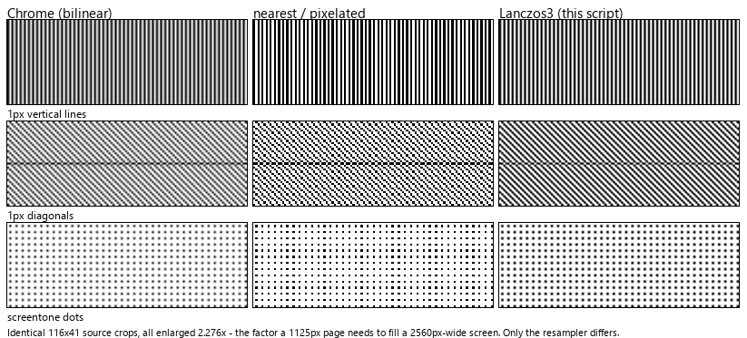
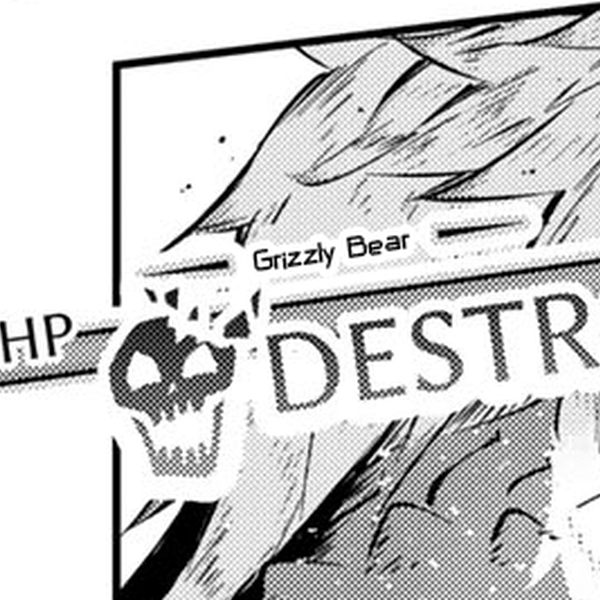
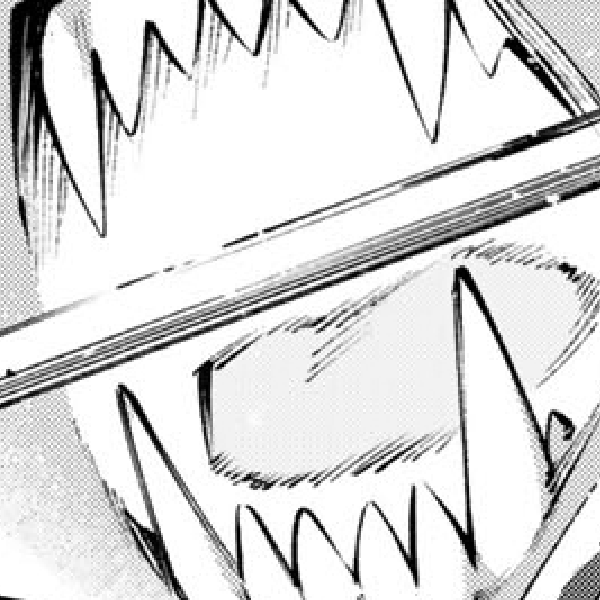

# Crisp Images

**Images look soft on your 4K or HiDPI screen? This fixes it.**

At 200% display scaling, or on any Retina screen, the browser draws a 1125-pixel-wide image across 2250 physical pixels. It has to invent three out of every four pixels, and it uses a cheap filter to do it. That is the mushy, washed-out look you may have noticed.

This script redraws those images with a proper **Lanczos3** filter on your GPU, at exactly the size they will appear, so the browser's own scaling never touches them.



There are real-world comparisons [further down](#real-world-comparisons).

Built for reading manga, comics and webtoons. Works on any image, [anywhere](#privacy), and has features that help at any scaling, even 100%.

## Install

1. Install [Tampermonkey](https://www.tampermonkey.net/) or [Violentmonkey](https://violentmonkey.github.io/).
2. Install the script.
3. Open a page with a big image and press **`Alt+P`** to switch it on for that site.
4. Press `Alt+H` to see what it is doing.

**The script starts switched off**, so it never changes a page you did not ask it to. `Alt+P` is remembered per site: switch a site on once and it stays on; switch it off and it stays off. To have it on everywhere, set `enabledOnStart: true` in the script. To have nothing remembered, set `rememberPerSite: false`.

## Controls

| Key                                 | What it does                                                                                    |
| ----------------------------------- | ----------------------------------------------------------------------------------------------- |
| `Alt+P`                             | Switch on or off for this site. Remembered per site                                             |
| `Alt+M`                             | Size: fill the width → biggest whole-number zoom → one image pixel per screen pixel             |
| `Alt+Q`                             | Filter: Lanczos3 → nearest → browser. Same size each time, so you can compare                   |
| `Alt+H`                             | Show or hide the info overlay. Remembered per site                                              |
| `Alt+G`                             | Show or hide the overlay's diagnostic rows (size, factor, status, memory)                       |
| `Alt+[` / `Alt+]`                   | Narrower / wider black bars at the sides of each image, 0.5% of the window a step; hold to keep going. Remembered per site |
| `Alt` + left click<br/>on an image  | Show that one image at one image pixel per screen pixel                                         |
| `Alt` + right click<br/>on an image | Show that one image at twice its own resolution                                                 |

- **Every shortcut can be changed** at the bottom of the config, and the overlay shows whatever you set.
- On a Mac, `Alt` is `Option`. Shortcuts also work on non-Latin keyboard layouts.
- Keys do nothing while you are typing in a text field.
- Click shortcuts work even when the site puts an invisible overlay over its pages. Any other click is left alone, so `Alt` + click on a link still downloads it.
- Enlarging one image never moves the others sideways.
- The side bars count as part of the image: the image shrinks to make room, so nothing else on the page moves. They apply in fit-width and whole-number zoom.

## Filling the width

"Fit width" fills all the free width beside the image, right to the edges of the window. It stops at anything next to the image, such as a sidebar, a panel or text, and at any edge that would cut the image off. Nothing on the page moves sideways; content below moves down as the image grows.

So a site with a narrow centred column gets the full width instead of empty bars on both sides, and the image never slides under a site's side panel. If you would rather keep the site's own column, set `fitWidth: 'container'`.

## A note on memory

To make switching filters and scrolling back instant, resampled images are kept in memory. On sites that take their image data back after loading, a copy of the original is kept too. That is up to 64 MB per tab. Fine for a handful of tabs, but it adds up with many image-heavy tabs open.

Easy ways to keep it in check:

- Only switch on the sites you actually read. A site that is off costs nothing.
- Press **`Alt+P`** on a site you are finished with.
- **Close tabs** you are done with. Everything is freed straight away.
- Use a tab suspender such as **The Marvelous Suspender**, or Chrome's built-in **Memory Saver**. Both work well with this script.

## Configuration

Edit the `CFG` block at the top of the script.

| Setting                                | Default     | What it does                                                                                              |
| -------------------------------------- | ----------- | --------------------------------------------------------------------------------------------------------- |
| `enabledOnStart`                       | `false`     | Start switched on for every site. Off means nothing happens until you press `Alt+P`                       |
| `hudOnStart`                           | `true`      | Show the overlay when a page opens. `Alt+H` changes it, remembered per site                               |
| `rememberPerSite`                      | `true`      | Remember `Alt+P`, `Alt+H` and the side bars per site. `false`: every page starts from these settings       |
| `detailsOnStart`                       | `false`     | Show the overlay's diagnostic rows when a page opens. `Alt+G` toggles them until the page reloads         |
| `minNaturalWidth` / `minNaturalHeight` | 700 / 1066  | Leave smaller images alone: avatars, icons, banners. 700 is just wide enough for Webtoons' strips |
| `mode`                                 | `fit-width` | Size to start with                                                                                        |
| `quality`                              | `lanczos3`  | Filter to start with                                                                                      |
| `fitWidth`                             | `space`     | What "fit width" fills: all the free width (`space`), the site's column (`container`), or the window (`window`) |
| `fitHeightToo`                         | `false`     | Fit the height as well, so a whole page fits on screen                                                    |
| `sideBars`                             | 0           | Black bars at the left and right of each image, as a percentage of the window's width on each side. `Alt+[` / `Alt+]` change it |
| `viewerHeight`                         | 0.95        | On readers whose pages sit in a fixed-height viewer box (K MANGA): its height as a share of the window. `0` turns this off |
| `maxOutputPixels`                      | 64M         | Don't resample beyond this many output pixels                                                             |
| `blobBudget`                           | 64 MB       | Memory for keeping resampled images ready ([see above](#a-note-on-memory))                                |
| `lazyMargin`                           | 1.5         | How many screenfuls ahead to get images ready, so they are done before you scroll to them                 |
| `keyToggle`, `keyMode`, `keyQuality`, `keyOverlay`, `keyDetails`, `keyBarsLess`, `keyBarsMore` | `Alt+P` ... | Keyboard shortcuts, like `'Ctrl+Shift+K'` or `'F2'`. `''` turns one off          |
| `clickNative`, `clickDouble`           | `Alt+LeftClick`, `Alt+RightClick` | Click shortcuts: modifiers plus `LeftClick`, `RightClick` or `MiddleClick`          |

## Local files

Chrome won't run any userscript on `file://` pages until you enable **Allow access to file URLs** in `chrome://extensions` → Tampermonkey → Details.

Even then, Chrome keeps files on disk away from the GPU. You still get the sizing options and `nearest`, but `lanczos3` falls back to the browser's own scaling and says so in the overlay. To get full quality on a folder of local images, serve it over `http://localhost`.

## Privacy

It runs on every site, but with `@grant none` and no external libraries. **Nothing is sent anywhere and no third party is ever contacted.** It reads images already on the page, redraws them on your GPU, and puts them back.

The only request it can make is re-reading an image the page has already loaded: the same URL, usually straight from cache.

It stores two small on/off flags per site, and only when you press the key:

```
crispImages.enabled.<host>   Alt+P
crispImages.hud.<host>       Alt+H
```

About 70 bytes. No cookies, no databases. `@grant none` means the userscript storage APIs aren't even available to it.

To limit it to particular sites, change `@match`.

## Real-world comparisons

You can use [testkit/compare.html](https://github.com/Ikkoru/crisp-images/tree/main/testkit) to compare the test images in the same folder, or an image of your own.

<p align="left">
<strong>Text crop:</strong>

Lanczos3:<br>


Bilinear (browser):<br>


Nearest Neighbour:<br>


<strong>Line Art crop:</strong>

Lanczos3:<br>


Bilinear (browser):<br>


Nearest Neighbour:<br>


</p>

## Why not just `image-rendering: pixelated`?

Because nearest-neighbour is only correct at whole-number zooms. At 2.276× (about what a 1125px page needs to fill a 2560px-wide screen), it doubles some rows of pixels and drops others. That is the uneven, staircased look in the middle column of the first comparison. Lanczos3 has no such restriction.

`crisp-edges` behaves exactly like `pixelated` in Chrome, and `-webkit-optimize-contrast` is an old alias that does nothing. There is no CSS keyword for a good filter, which is why this one runs on the GPU.

## Is it really Lanczos3?

You don't have to take my word for it. [testkit/shader-selftest.html](https://github.com/Ikkoru/crisp-images/tree/main/testkit) runs the shipping shader against a separate reference implementation and prints the difference:

```
2.276x (fill width)   mean|d|=0.057  max|d|=1
2.000x (integer)      mean|d|=0.003  max|d|=1
1.138x                mean|d|=0.080  max|d|=1
0.640x (downscale)    mean|d|=0.201  max|d|=1
```

The two passes keep their in-between result in a half-float texture. An 8-bit one clips the overshoot Lanczos produces at hard edges, which costs about 25 levels of accuracy on exactly the high-contrast line art comics are made of.

## Limitations

- It swaps the image's `src` for a resampled copy. A site that manages that element itself may fight it; after a few tries the script gives up on that image and leaves it to the browser. `Alt+P` turns the script off for a site.
- Images from another domain need [CORS headers](#when-a-site-wont-let-the-script-resample) before the GPU can read them. Without those, the script sizes them but cannot resample them.
- **GIFs** are sized but not resampled, so an animation keeps moving. A resample is a single still frame. (Animated WebP and PNG cannot be told apart from still ones, so they are resampled and stop moving. Press `Alt+Q` to `browser` if that matters.)
- Very tall images, over about 16,000 pixels once enlarged (long webtoon strips), are left to the browser's scaling. That is the most the GPU or the image format can take in one piece. The overlay says so.
- The first time an image is drawn at a given size and filter costs a moment. Repeats come from memory.
- Where the GPU can't be used, `nearest` falls back to CSS.
- Pages drawn onto a `<canvas>` instead of shown as images are only handled on K MANGA, where they are sized but never resampled (see [supported sites](supported-sites.md)). Resizing just any canvas would break games, maps and charts.
- Some phone GPUs drew Lanczos3 wrong past about 1024 pixels (GitHub issue #1; its reporter found the fix, in 4.2). Since 4.2 the script also checks the GPU against a reference resample at a realistic size before using it: if the 16-bit working texture fails it uses 8 bits, and if that fails too it leaves images to the browser. The overlay's status says which.
- A page whose height is right at the window's could make the scrollbar come and go without end, as each change resized the image. Since 4.2 the script notices and keeps the scrollbar's space reserved on that page.

## When a site won't let the script resample

On most sites the script reads the image, resamples it, and puts the sharper version back. On a few, the browser won't let it read the image at all. When that happens the overlay says something like:

    chrome bilinear — cross-origin, and the image host sends no CORS headers

This is a browser security rule, not a fault on anyone's part, and the script can't get around it from inside the page. The only fix would be asking you for extra permissions, which would make the script much more suspicious.

**What still works on those sites**

- Sizing: the image is laid out at the size you asked for.
- `nearest` (`Alt+Q`): it's a CSS filter, so it never reads pixels.

**What doesn't**

- Lanczos3, which is the main thing the script is for.

If a site looks untouched and you're not sure why, press `Alt+H`, then `Alt+G`, and read the status line. It also says when an image was skipped for being too small.

## Something looks wrong?

Run `__crispImages.report()` in the browser console. It lists every image the script knows about and what it did with each one, which is the most useful thing to include in a bug report. `__crispImages.memory()` shows what the cache is holding, and `__crispImages.layout(img)` shows the width it is filling for an image.

For timings, paste `__crispImages.trace = true` into the console and reproduce the lag. Add the output to your bug report.

## Licence

MIT - see [LICENSE](LICENSE). © 2026 Igkor Bevzenidis.

Issues and pull requests: <https://github.com/Ikkoru/crisp-images>
